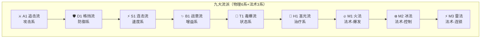

# 技能树设计（Roguelike 版）

> 核心规则：每个流派拥有**4层技能树**，从普攻(L1)出发，经被动(L2)、主动(L3)，最终解锁大招(L4)
> 所有技能已迁移至 **Timeline 执行体系**，技能脚本必须实现 `BuildTimeline` 函数

## 技能树总览



## 9流派 × 4层 完整配置表

| 系 | 流派 | L1 普攻 | L2 被动 | L3 主动 | L4 大招 | 核心体验 |
|:--:|:----:|:--------|:--------|:--------|:--------|:---------|
| **⚔️ 攻击** | A1 追击流 | 刺击 110% +20%暴 | 追击 击杀100%追击 | 斩杀 CD2 最低血200%可追击 | 收割 100E 全场斩杀 | 收割机器 |
| **🛡️ 防御** | D1 格挡流 | 盾击 100% +单体挑衅 | 格挡 25%格挡减伤50%格挡必反击 | 反击姿态 CD3 群体挑衅+必反击 | 盾墙 100E 2回合100%格挡且反击 | 铜墙铁壁 |
| **⚡ 速度** | S1 连击流 | 连斩 100% 25%连击 | 连击精通 连击概率50% | 双连斩 CD3 随机2目标连击 | 连击风暴 100E 6次随机分配 | 狂风暴雨 |
| **✨ 增益** | B1 战意流 | 战击 110% | 战意沸腾 攻防速+5%叠5层 | 全军突击 CD3 全体+20%攻 | 战神降临 100E 全体+50%攻防速 | 越战越勇 |
| **🔮 状态** | T1 毒爆流 | 毒击 100% 命中附1层毒 | 感染 中毒每回合加深1层 | 毒雾 CD3 随机3目标附2层毒 | 毒性爆发 100E 引爆所有中毒 | 慢性死亡 |
| **💚 治疗** | H1 圣光流 | 圣光 100%敌伤/己回10% | 亲和 自身每回合回血10% | 群疗 CD3 血量最少3友军+20% | 圣光普照 100E 全体满血+清除负面 | 团队奶妈 |
| **🔥 法术-爆发** | M1 火法 | 火球术 120%法伤 | 火焰亲和 法伤+15%燃烧 | 爆炸火球 CD3 100%范围 | 陨石术 100E 200%全体燃烧 | 爆发输出 |
| **❄️ 法术-控制** | M2 冰法 | 冰箭术 100%法伤减速 | 寒冰亲和 冰冻+10%法伤 | 冰霜新星 CD3 冻结1回合 | 暴风雪 100E 150%全体冻结1回合 | 控场大师 |
| **⚡ 法术-连锁** | M3 雷法 | 闪电箭 110%法伤 | 雷电亲和 20%连锁 | 连锁闪电 CD3 弹射4次 | 雷暴术 100E 全体100%连锁 | 连锁收割 |

---

## 4层技能树通用结构

```
【所有流派统一遵循的4层进化链】

Layer 1 (根)        Layer 2           Layer 3           Layer 4 (末)
  普攻(N)     →     被动(P)     →     主动(A)     →     大招(U)
  ┌────────┐       ┌────────┐       ┌────────┐       ┌────────┐
  │定义流派│  →    │常驻特性│  →    │ CD爆发 │  →    │ 终结技 │
  │基础手感│       │战斗风格│       │节奏控制│       │高潮时刻│
  │cost=0  │       │自动生效│       │不耗能量│       │cost=100│
  └────────┘       └────────┘       └────────┘       └────────┘
      │                 │                │                │
  决定攻击方式      决定生存/输出      决定爆发窗口      决定胜利手段

【解锁条件】L1→L2→L3→L4 逐级解锁
【资源规则】普攻回能20/回合，被动常驻，主动CD，大招100能量
```

---

## ⚔️ 攻击系 — A1 追击流

> **核心体验**：击杀追击，连锁收割

| 层级 | 技能名 | Type | 效果 |
|:----:|:-------|:----:|:-----|
| L1 | 刺击 | Normal | 110%伤害，+20%暴击率 |
| L2 | 追击 | Passive | 击杀敌人后100%概率免费追击一次 |
| L3 | 斩杀 | Active | CD2，对血量最低的目标造成200%伤害，可触发追击 |
| L4 | 收割 | Ultimate | 100能量，对全场所有敌人各进行一次斩杀（200%伤害，可触发追击） |

---

## 🛡️ 防御系 — D1 格挡流

> **核心体验**：铜墙铁壁，反击反伤

| 层级 | 技能名 | Type | 效果 |
|:----:|:-------|:----:|:-----|
| L1 | 盾击 | Normal | 100%伤害，附加单体挑衅（强制目标攻击自己） |
| L2 | 格挡 | Passive | 受击时25%概率格挡，减少50%伤害；格挡成功时立即反击100%伤害 |
| L3 | 反击姿态 | Active | CD3，群体挑衅所有敌人，且下次受击时必定反击150%伤害 |
| L4 | 盾墙 | Ultimate | 100能量，2回合内100%格挡所有攻击，每次格挡必定反击150%伤害 |

---

## ⚡ 速度系 — S1 连击流

> **核心体验**：狂风暴雨，多次攻击

| 层级 | 技能名 | Type | 效果 |
|:----:|:-------|:----:|:-----|
| L1 | 连斩 | Normal | 100%物理伤害，25%概率连击一次（额外100%伤害） |
| L2 | 连击精通 | Passive | 连击概率提升至50% |
| L3 | 双连斩 | Active | CD3，对随机两个目标各发动一次连击（每次100%伤害） |
| L4 | 连击风暴 | Ultimate | 100能量，连续攻击6次，每次随机选择存活敌人（每次100%伤害） |

---

## ✨ 增益系 — B1 战意流

> **核心体验**：越战越勇，攻防速全面提升

| 层级 | 技能名 | Type | 效果 |
|:----:|:-------|:----:|:-----|
| L1 | 战击 | Normal | 110%物理伤害 |
| L2 | 战意沸腾 | Passive | 击杀敌人后攻击+5%，防御+5%，速度+5%，可叠加5层 |
| L3 | 全军突击 | Active | CD3，接下来3回合全体友方攻击+20% |
| L4 | 战神降临 | Ultimate | 100能量，接下来3回合全体友方攻击+50%，防御+50%，速度+50% |

---

## 🔮 状态系 — T1 毒爆流

> **核心体验**：叠毒→加深→毒爆，慢性死亡

| 层级 | 技能名 | Type | 效果 |
|:----:|:-------|:----:|:-----|
| L1 | 毒击 | Normal | 100%伤害，命中时附加1层中毒（每层每回合损失2%最大生命值） |
| L2 | 感染 | Passive | 中毒目标每回合开始时，中毒层数自动+1 |
| L3 | 毒雾 | Active | CD3，攻击随机3个目标，每个目标附加2层中毒 |
| L4 | 毒性爆发 | Ultimate | 100能量，引爆所有中毒敌人，每层中毒造成50%额外伤害，并清除中毒层数 |

---

## 💚 治疗系 — H1 圣光流

> **核心体验**：团队奶妈，攻守兼备

| 层级 | 技能名 | Type | 效果 |
|:----:|:-------|:----:|:-----|
| L1 | 圣光 | Normal | 对敌人造成100%法术伤害，或对己方回复10%最大生命值 |
| L2 | 亲和 | Passive | 自身每回合开始时回复10%最大生命值 |
| L3 | 群疗 | Active | CD3，为血量最少的3个友军各回复20%最大生命值 |
| L4 | 圣光普照 | Ultimate | 100能量，全体友方恢复100%生命，并清除负面状态 |

---

## 🔥 法术系-爆发 — M1 火法

> **核心体验**：高爆发AOE，火焰燃烧

| 层级 | 技能名 | Type | 效果 |
|:----:|:-------|:----:|:-----|
| L1 | 火球术 | Normal | 120%法术伤害，附带5%燃烧伤害/回合 |
| L2 | 火焰亲和 | Passive | 火焰法术伤害+15%，燃烧效果持续+2回合 |
| L3 | 爆炸火球 | Active | CD3，对目标及范围造成100%爆炸伤害 |
| L4 | 陨石术 | Ultimate | 100能量，对全体敌人造成200%伤害，附带3层燃烧 |

---

## ❄️ 法术系-控制 — M2 冰法

> **核心体验**：冰冻减速，全场控制

| 层级 | 技能名 | Type | 效果 |
|:----:|:-------|:----:|:-----|
| L1 | 冰箭术 | Normal | 100%法术伤害，目标速度-30% 2回合 |
| L2 | 寒冰亲和 | Passive | 冰冻概率+10%，冰冻伤害+10% |
| L3 | 冰霜新星 | Active | CD3，范围冰冻，敌人冻结1回合无法行动 |
| L4 | 暴风雪 | Ultimate | 100能量，对全体敌人造成150%伤害，50%概率冻结1回合 |

---

## ⚡ 法术系-连锁 — M3 雷法

> **核心体验**：闪电连锁，弹射收割

| 层级 | 技能名 | Type | 效果 |
|:----:|:-------|:----:|:-----|
| L1 | 闪电箭 | Normal | 110%法术伤害，20%概率弹射到相邻敌人 |
| L2 | 雷电亲和 | Passive | 连锁概率+20%，弹射伤害衰减-10% |
| L3 | 连锁闪电 | Active | CD3，放出连锁闪电，最多弹射4次，每次100%伤害 |
| L4 | 雷暴术 | Ultimate | 100能量，全屏雷暴，每个敌人受到100%伤害，自动连锁弹射 |

---

## Buff 系统一览

| Buff ID | 名称 | 类型 | 持续 | 叠加 | 效果 |
|---------|------|------|------|------|------|
| 820001 | 挑衅 | 减益 | 1回合 | 不可叠 | 强制攻击施法者 |
| 820002 | 反击姿态 | 增益 | 永久(99) | 不可叠 | 受击必反击150% |
| 820003 | 盾墙 | 增益 | 2回合 | 不可叠 | 100%格挡+反击150% |
| 840001 | 战意 | 增益 | 永久(99) | 可叠5层 | 每层攻/防/速+5% |
| 840002 | 全军突击 | 增益 | 3回合 | 不可叠 | 全体攻击+20% |
| 840003 | 战神降临 | 增益 | 3回合 | 不可叠 | 全体攻/防/速+50% |
| 850001 | 中毒 | 减益 | 永久(99) | 可叠99层 | 每层每回合2%最大生命DOT |
| 860001 | 亲和 | 增益 | 永久(99) | 不可叠 | 每回合回复10%最大生命 |
| 870001 | 燃烧 | 减益 | 2回合 | 可叠99层 | 每层每回合5%最大生命DOT |
| 870002 | 火焰亲和 | 增益 | 永久(99) | 不可叠 | 火焰伤害+15% |
| 880001 | 减速 | 减益 | 2回合 | 不可叠 | 速度-30% |
| 880002 | 冻结 | 控制 | 1回合 | 不可叠 | 无法行动 |

---

## Timeline 执行体系

所有技能已迁移至 Timeline 执行体系，技能脚本必须实现 `BuildTimeline` 函数，返回逻辑帧序列：

```lua
function skill_80007003.BuildTimeline(hero, targets, skill)
    return {
        { frame = 0, op = "cast", execute = function(ctx, f) ... end },
        { frame = 10, op = "hit", execute = function(ctx, f) ... end },
        { frame = 20, op = "damage", execute = function(ctx, f) ... end },
    }
end
```

### 帧事件类型

| op | 说明 |
|----|------|
| cast | 技能释放，派发 SKILL_CAST_STARTED 事件 |
| hit | 命中判定 |
| damage | 伤害结算，调用 CalculateDamageWithRate |
| heal | 治疗结算，调用 CalculateHeal |
| buff | Buff 施加 |
| effect | 特效触发（纯表现层事件） |

### 执行流程

```
CastSkillInSeq
  └─ LoadSkillLua(skillId)
  └─ skillScript.BuildTimeline(hero, targets, skill)
  └─ SkillTimeline.Execute(hero, targets, skill, timeline)
       ├─ 排序帧序列 (按 frame 升序)
       ├─ 逐帧执行 frame.execute(context, frameCopy)
       ├─ 每帧派发 SKILL_TIMELINE_FRAME 事件
       ├─ 累计 totalDamage / totalHeal
       └─ 派发 SKILL_TIMELINE_COMPLETED 事件
```

---

## 流派组合推荐

| 组合名称 | 流派搭配 | 玩法特点 |
|:---------|:---------|:---------|
| **收割连击** | A1追击流 + S1连击流 | 无限追击+无限连击 |
| **毒爆战士** | A1追击流 + T1毒爆流 | 追击+叠毒，收割更快 |
| **不死坦克** | D1格挡流 + H1圣光流 | 格挡+治疗，打不死 |
| **风卷残云** | S1连击流 + B1战意流 | 攻速拉满，越战越勇 |
| **冰火交加** | M1火法 + M2冰法 | 燃烧+冻结，输出控制兼顾 |
| **雷光火雨** | M1火法 + M3雷法 | 爆发+连锁，清屏超快 |
| **冰电控场** | M2冰法 + M3雷法 | 冻结+连锁，全程控场 |
| **毒爆全场** | T1毒爆流 + D1格挡流 | 慢慢磨血，盾住血线 |
| **团队核心** | H1圣光流 + D1格挡流 | 治疗+防御，稳扎稳打 |
| **法术全开** | M1火法 + M2冰法 + M3雷法 | 三系法术全覆盖，碾压一切 |
