# 技能树设计（Roguelike 版）

> 规则：所有特性默认可互相触发，无内置联动限制

```mermaid
flowchart LR
    Start[【起点】]

    subgraph 攻击系["⚔️ 攻击系"]
        direction TB
        A1[连击流]
        A1 --> A11[连击概率+]
        A11 --> A111[连击次数+1]
        A111 --> A1111[无限连击]
        A1 --> A12[连击伤害+]

        A2[反击流]
        A2 --> A21[反击概率+]
        A21 --> A211[反击必暴]
        A211 --> A2111[反击无视防御]
        A2 --> A22[反击范围]
        A22 --> A221[反击全体]

        A3[追击流]
        A3 --> A31[追击次数+]
        A31 --> A311[追击伤害+]
        A31 --> A312[追击可暴]
        A3 --> A32[追击条件]
        A32 --> A321[低血追击]
        A32 --> A322[暴击追击]

        Atk --> A1
        Atk --> A2
        Atk --> A3
    end

    subgraph 防御系["🛡️ 防御系"]
        direction TB
        D1[格挡流]
        D1 --> D11[格挡概率+]
        D11 --> D111[格挡减伤+]
        D111 --> D1111[格挡反击]
        D1 --> D12[完美格挡]
        D12 --> D121[反弹伤害]

        D2[闪避流]
        D2 --> D21[闪避概率+]
        D21 --> D211[闪避后加速]
        D211 --> D2111[闪避后连击]
        D2 --> D22[完美闪避]
        D22 --> D221[时停反击]

        D3[生存流]
        D3 --> D31[生命上限+]
        D31 --> D311[濒死保护]
        D311 --> D3111[免死回血]
        D3 --> D32[回复强化]
        D32 --> D321[受击回血]

        Def --> D1
        Def --> D2
        Def --> D3
    end

    subgraph 速度系["⚡ 速度系"]
        direction TB
        Sp1[先攻流]
        Sp1 --> Sp11[开局加速]
        Sp11 --> Sp111[开局加攻]
        Sp1 --> Sp12[开局控制]

        Sp2[行动流]
        Sp2 --> Sp21[击杀拉条]
        Sp21 --> Sp211[额外回合]
        Sp2 --> Sp22[行动后加速]

        Sp3[速度强化]
        Sp3 --> Sp31[基础速度+]
        Sp31 --> Sp311[行动条获取+]
        Sp3 --> Sp32[多动]
        Sp32 --> Sp321[连续行动]

        Speed --> Sp1
        Speed --> Sp2
        Speed --> Sp3
    end

    subgraph 增益系["✨ 增益系"]
        direction TB
        B1[开局增益]
        B1 --> B11[开局加攻]
        B11 --> B111[开局加防]
        B1 --> B12[开局护盾]

        B2[击杀增益]
        B2 --> B21[击杀加攻]
        B21 --> B211[击杀叠层]
        B2 --> B22[击杀回能]

        B3[能量流]
        B3 --> B31[能量上限+]
        B31 --> B311[能量回复+]
        B3 --> B32[技能强化]
        B32 --> B321[技能消耗降低]

        Buff --> B1
        Buff --> B2
        Buff --> B3
    end

    subgraph 状态系["🔮 状态系"]
        direction TB
        S1[攻击状态]
        S1 --> S11[吸血]
        S11 --> S111[吸血转化护盾]
        S1 --> S12[破甲]
        S12 --> S121[无视防御]

        S2[控制状态]
        S2 --> S21[减速]
        S21 --> S211[冰冻]
        S2 --> S22[沉默]
        S22 --> S221[眩晕]

        S3[负面状态]
        S3 --> S31[中毒]
        S31 --> S311[中毒扩散]
        S3 --> S32[灼烧]
        S32 --> S321[灼烧爆炸]

        Status --> S1
        Status --> S2
        Status --> S3
    end

    subgraph 治疗系["💚 治疗系"]
        direction TB
        H1[治疗流]
        H1 --> H11[治疗量+]
        H11 --> H111[治疗暴击]
        H111 --> H1111[过量转护盾]
        H1 --> H12[群体治疗]

        H2[护盾流]
        H2 --> H21[护盾强度+]
        H21 --> H211[破盾回血]
        H2 --> H22[护盾再生]
        H22 --> H221[脱战快速回盾]

        H3[复活流]
        H3 --> H31[战斗复活]
        H31 --> H311[复活加增益]
        H3 --> H32[濒死保护]
        H32 --> H321[免死回血]

        Heal --> H1
        Heal --> H2
        Heal --> H3
    end

    Start --> Atk
    Start --> Def
    Start --> Speed
    Start --> Buff
    Start --> Status
    Start --> Heal
```

## 组合示例

| 流派名称 | 核心组合 | 玩法特点 |
|---------|---------|---------|
| 血魔流 | 连击流 + 吸血 | 越打血越多 |
| 破甲刺客 | 追击流 + 破甲 | 专打高防敌人 |
| 控制反击 | 反击流 + 眩晕 | 反击即控场 |
| 冰冻连击 | 连击流 + 冰冻 | 冻住再连击 |
| 毒爆流 | 追击流 + 中毒扩散 | 击杀传染毒素 |
| 圣骑士 | 格挡流 + 治疗流 | 能抗能打能奶 |
| 复活法师 | 控制流 + 复活流 | 控住再复活队友 |
| 极速刺客 | 先攻流 + 连击流 | 先出手秒人 |
| 永动机 | 行动流 + 能量流 | 一直动一直爽 |
| 狂暴治疗 | 连击流 + 治疗流 | 打人回血两不误 |

## 机制说明

1. **状态附着**：攻击系技能可附加状态系效果
   - 例：连击时附加吸血/破甲/减速

2. **触发联动**：状态可被攻击系触发
   - 例：敌人冰冻时，追击伤害翻倍

3. **治疗定位**：治疗系作为独立分支，可与攻击/防御/状态自由组合

## 法攻流（法师固定树）

法师专属技能树，三元素选一，初始单体，升级后获得范围/穿透/弹射能力。

### 基础节点

- **M1[魔力觉醒]**：法术伤害+15%
- **M2[元素选择]**：选择火/冰/雷之一，确定后本局不可更改

### 火系 — 十字爆炸

| 节点 | 效果 |
|------|------|
| F1[火球术] | 单发火球，150%单体伤害 |
| F2[爆裂] | 火球附带十字范围爆炸，主目标150%，溅射50% |
| F3[强效] | 伤害+30% 或 范围+斜向 |
| F4[分支] | 炎爆：伤害+50%，范围变3×3；连珠：连续2发火球 |
| F5[终极-炎爆] | 地狱火：5×5范围，中心300%伤害 |
| F5[终极-连珠] | 流星雨：4连发火球 |

### 冰系 — 纵向贯穿

| 节点 | 效果 |
|------|------|
| I1[冰箭术] | 单发冰箭，120%单体伤害+30%减速 |
| I2[穿透] | 冰箭可穿透同列前后排，前排100%，后排70% |
| I3[极寒] | 伤害+20% 或 减速提升至50% |
| I4[分支] | 长矛：穿透伤害不衰减；扩散：命中后向两侧分裂 |
| I5[终极-长矛] | 绝对零度：无限穿透，伤害递增 |
| I5[终极-扩散] | 暴风雪：大范围持续伤害 |

### 雷系 — 相邻弹射

| 节点 | 效果 |
|------|------|
| T1[闪电术] | 单体闪电，130%伤害+高暴击率 |
| T2[弹射] | 闪电可弹射到相邻目标（8方向），最多3次，每次-20%伤害 |
| T3[感电] | 伤害+20% 或 弹射次数+2 |
| T4[分支] | 聚焦：弹射不衰减，优先低血量；扩散：弹射附带小范围溅射 |
| T5[终极-聚焦] | 雷神之怒：弹射10次，必定暴击 |
| T5[终极-扩散] | 雷暴：全场随机落雷 |

### 阵型适配

- **火系**：站中间打中间，十字范围最大（中前/中后最优）
- **冰系**：站前排打贯穿，穿透前后排
- **雷系**：找敌人密集区弹射，人越多越强
